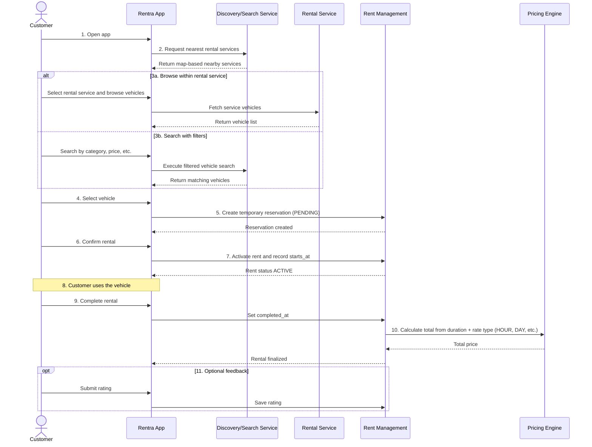

# RFC-001: Basic Rental Flow

**Status:** Approved

**Author:** Omar Ismayilov

## Short Description

This RFC defines the MVP rental journey for Rentra. The system enables customers to discover nearby rental services, browse available vehicles, reserve and rent a vehicle, and complete the rental with automatic price calculation based on rental duration and configured rate type (for example `HOUR` or `DAY`). The objective is a simple and reliable end-to-end flow without advanced features.

## Flow Diagram

## API Design

The following endpoints are sufficient to support the RFC-001 basic rental flow.

- `GET /services` - List rental services for map-based discovery (supports geo params).
- `GET /services/{serviceId}/vehicles` - List vehicles for a specific rental service.
- `GET /vehicles/search?...` - Search vehicles by filters.
- `GET /vehicles/{vehicleId}` - Get vehicle details, rates, and current availability signal.
- `POST /reservations` - Create temporary reservation in `PENDING` state.
- `POST /reservations/{id}/confirm` - Confirm reservation and activate rental.
- `GET /rents/active` - Get customer's currently active rent.
- `POST /rents/{id}/complete` - Complete rental, set completion time, and trigger final price calculation.
- `POST /rents/{id}/rate` - Submit optional customer rating after completion.

## Future Extensions

- Payment integration
- Advanced booking (schedule in advance)
- Cancellation policies and penalties
- Real-time vehicle tracking (GPS)
- Dynamic pricing (demand-based)
- Improved availability system (time windows)
- Search optimization (geo indexing, Elasticsearch)
- Notifications (email, push)
