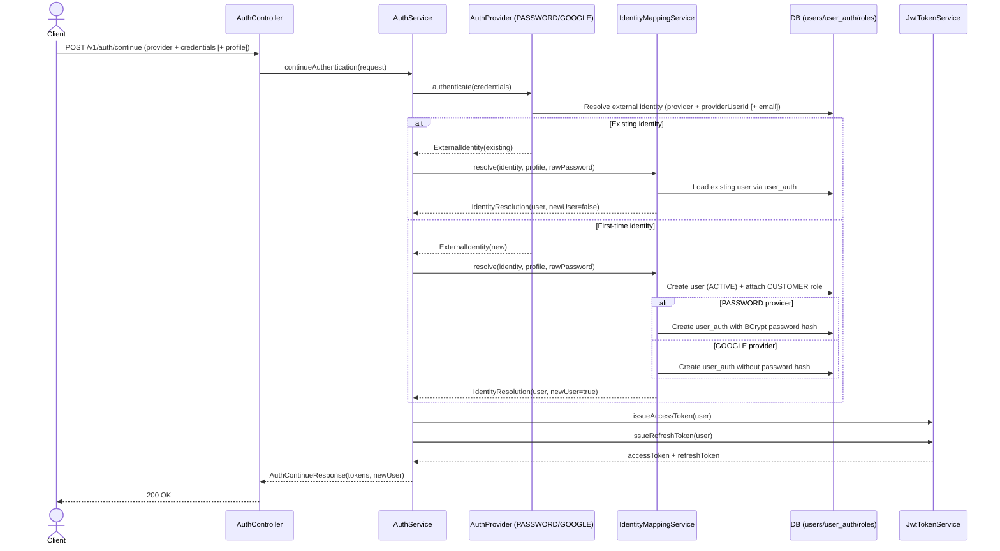
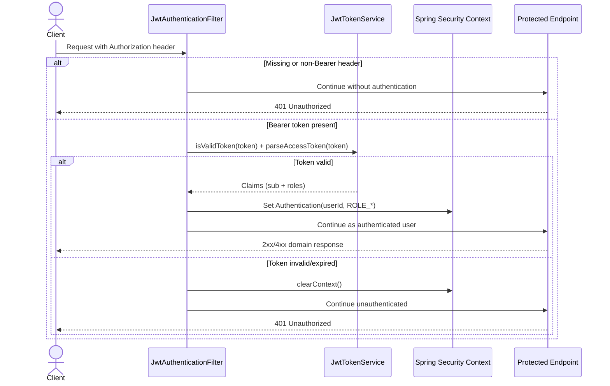

# Security and Authentication Flow

This document describes how security is implemented in the app today (as-built), including authentication providers, identity mapping, JWT handling, authorization boundaries, and concrete request examples.

## Current Security Model

- Authentication is stateless JWT-based (`Bearer <token>` in `Authorization` header).
- Only auth endpoints under `/v*/auth/**` are public.
- Every other endpoint requires a valid JWT.
- Roles are embedded into JWT (`roles` claim) and mapped to Spring authorities as `ROLE_<name>`.
- Password registrations are hashed with BCrypt before storage.
- Google sign-in is supported through Google ID token validation (`provider: GOOGLE`).

## Public vs Protected Endpoints

Configured behavior:

- `permitAll`: `/v*/auth/**`
- `authenticated`: every other route

At the moment, the only implemented auth endpoint is:

- `POST /v1/auth/continue` (public)

All future non-auth endpoints are protected by default unless explicitly whitelisted.

## Providers and Role Data

Seeded auth data:

- `auth_providers`: includes `PASSWORD`, `GOOGLE`
- `roles`: includes `CUSTOMER`, `ADMIN`

Auth provider model in code:

- Implemented providers: `PASSWORD`, `GOOGLE`.
- Enum also contains `GITHUB`, but it has no provider implementation yet and will be rejected as unsupported.

Current role model:

- New users get `CUSTOMER` role by default.
- `ADMIN` exists and can be assigned through data/admin operations.

## End-to-End Auth Continue Flow

`POST /v1/auth/continue` handles both login and first-time signup for all supported providers.



## Request Authorization Flow

Every protected request passes through JWT filter logic.



Unauthorized response detail:

- Missing/non-Bearer header -> `No authentication details were provided.`
- Invalid/expired token -> `JWT token is expired or invalid.`
- Response shape is JSON `ErrorResponse` with `status`, `error`, `message`, and `timestamp`.

## JWT Structure

Access token claims:

- `sub`: user UUID
- `iat`: issued timestamp
- `exp`: expiry timestamp (`JWT_ACCESS_TTL_SECONDS`, default 900)
- `roles`: array like `["CUSTOMER"]`, `["ADMIN"]`, etc.

Refresh token claims:

- `sub`: user UUID
- `iat`: issued timestamp
- `exp`: expiry timestamp (`JWT_REFRESH_TTL_SECONDS`, default 1209600)
- `type`: `"refresh"`

Signing:

- HMAC key from `JWT_SECRET` (`auth.jwt.secret`)

## Concrete Endpoint Examples

### 1) Signup via Continue (new user)

`POST /v1/auth/continue`

```json
{
  "provider": "PASSWORD",
  "credentials": {
    "email": "test@gmail.com",
    "password": "11111111"
  },
  "profile": {
    "firstName": "Test",
    "lastName": "Test",
    "email": "test@gmail.com",
    "birthDate": "1998-04-15"
  }
}
```

Typical response:

```json
{
  "accessToken": "<jwt-access-token>",
  "refreshToken": "<jwt-refresh-token>",
  "newUser": true
}
```

### 2) Login via Continue (existing user)

`POST /v1/auth/continue`

```json
{
  "provider": "PASSWORD",
  "credentials": {
    "email": "test@gmail.com",
    "password": "11111111"
  }
}
```

Typical response:

```json
{
  "accessToken": "<jwt-access-token>",
  "refreshToken": "<jwt-refresh-token>",
  "newUser": false
}
```

### 3) Signup via Continue (new Google user)

`POST /v1/auth/continue`

```json
{
  "provider": "GOOGLE",
  "credentials": {
    "idToken": "<google-id-token>"
  },
  "profile": {
    "firstName": "Test",
    "lastName": "Test",
    "email": "test@gmail.com",
    "birthDate": "1998-04-15"
  }
}
```

Typical response:

```json
{
  "accessToken": "<jwt-access-token>",
  "refreshToken": "<jwt-refresh-token>",
  "newUser": true
}
```

### 4) Login via Continue (existing Google user)

`POST /v1/auth/continue`

```json
{
  "provider": "GOOGLE",
  "credentials": {
    "idToken": "<google-id-token>"
  }
}
```

Typical response:

```json
{
  "accessToken": "<jwt-access-token>",
  "refreshToken": "<jwt-refresh-token>",
  "newUser": false
}
```

### 5) Calling a protected endpoint

Use the access token in the `Authorization` header:

```http
Authorization: Bearer <jwt-access-token>
```

Any non-`/v*/auth/**` endpoint without valid token returns unauthorized.

## Security Notes

- App is stateless (`SessionCreationPolicy.STATELESS`).
- CSRF is disabled, which is consistent with token-based API usage.
- Password provider accepts either `email` or `username` field from credentials.
- Google provider requires a valid Google ID token with matching audience (`GOOGLE_CLIENT_ID`) and verified email.
- There is currently no refresh endpoint exposed yet, even though refresh tokens are issued.

## Environment Requirements

Required env vars:

- `JWT_SECRET` (must be strong; sample suggests 64-char random secret)
- `JWT_ACCESS_TTL_SECONDS` (default `900`)
- `JWT_REFRESH_TTL_SECONDS` (default `1209600`)
- `GOOGLE_CLIENT_ID` (required for Google auth; if blank, Google auth fails as not configured)
