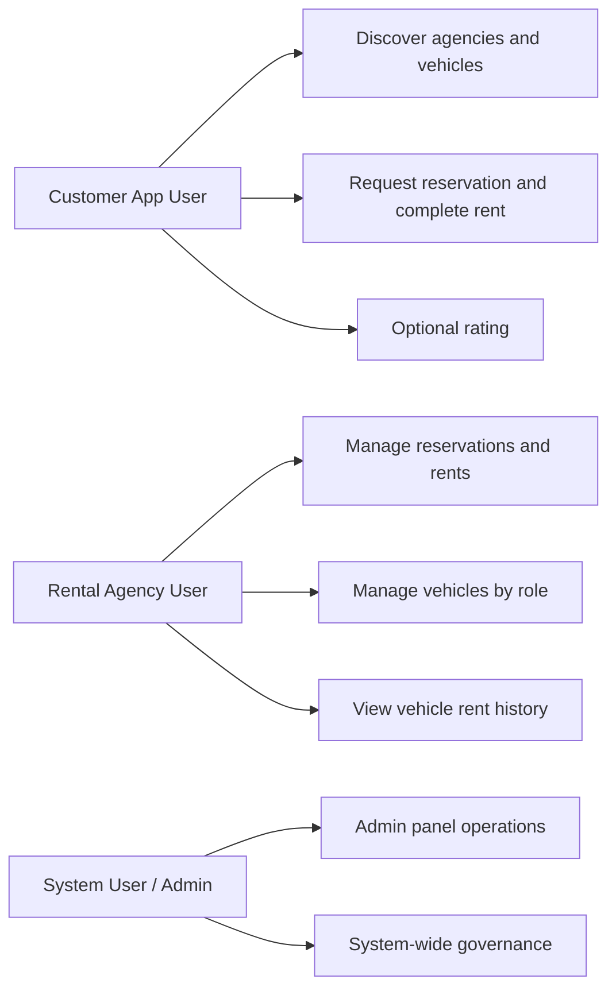
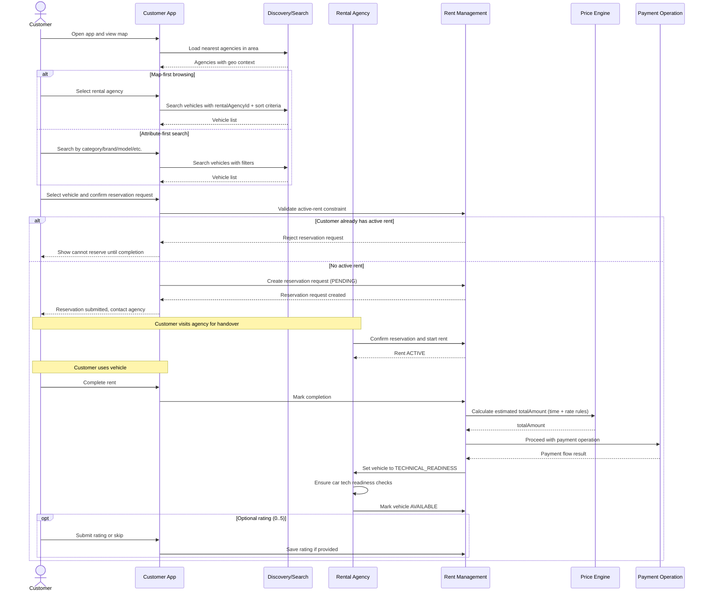
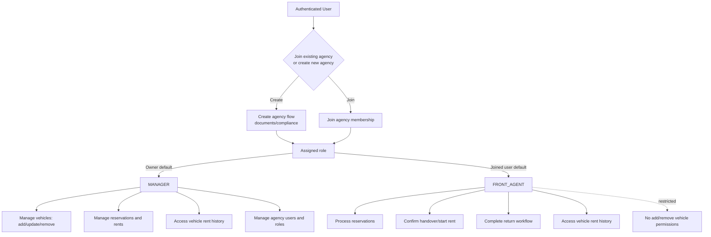
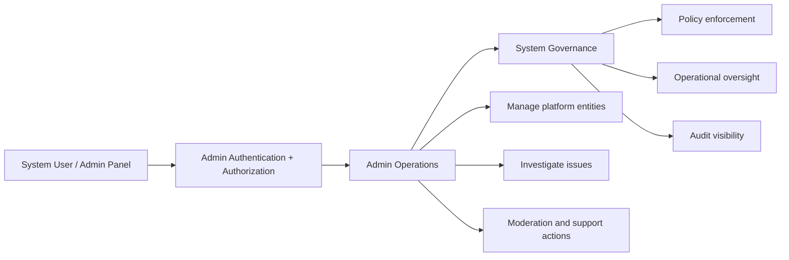

# System Flow

This document extends the basic rental journey with role-based behavior and operational states for a more realistic production flow.

It focuses on three user groups:

- Customer
- Rental Agency User
- System User (Admin panel)

No endpoint design is included in this document.

## Core Business Rules

- A customer can have at most one active rent at a time.
- If a customer has an active rent, the system must block new reservation requests.
- A reservation request becomes an active rent only after agency confirmation during handover.
- When rent is completed, pricing is calculated first; payment operation proceeds after that.
- After completion, vehicle does not become immediately available. It must pass a technical readiness stage before returning to `AVAILABLE`.
- Rent rating is optional (`0` to `5`) and can be skipped.

## High-Level Role Map

## 1) Customer Flow

Customer can reach vehicle selection through two entry points:

1. Map-first: customer opens map, sees nearest rental agencies, selects agency, sees best/nearby/price/rating-oriented vehicles.
2. Attribute-first: customer searches vehicles by filters (category, brand, model, etc.).

Both paths converge into the same vehicle discovery flow. In map-first flow, `rentalAgencyId` is simply pre-filled as a search attribute.

### Customer States (Conceptual)

- Reservation: `PENDING` -> `CONFIRMED` (agency confirms) -> closed by conversion to rent.
- Rent: `ACTIVE` -> `COMPLETED` -> payment operation.
- Vehicle after completion: `TECHNICAL_READINESS` -> `AVAILABLE`.

## 2) Rental Agency User Flow

After authentication, this user type can:

- Join an existing rental agency, or
- Create a new rental agency (separate compliance/document flow).

Once associated with an agency, permissions depend on role:

- `MANAGER`: full agency operations.
- `FRONT_AGENT`: reservation and rent operations, but no sensitive fleet management (for example add/remove vehicles).

By default:

- Agency creator/owner is `MANAGER`.
- Newly joined users are `FRONT_AGENT` unless promoted.

## 3) System User Flow

System users operate from the admin panel and own all admin endpoints.

## Cross-Flow Notes

- Reservation and rent lifecycle ownership is shared:
  - Customer initiates reservation request.
  - Agency confirms and transitions into active rent.
- Pricing and payment are decoupled at flow level:
  - Pricing computes `totalAmount`.
  - Payment operation proceeds as a follow-up stage.
- Vehicle availability is operationally safe:
  - Completion alone is not enough to return the vehicle to inventory.
  - Technical readiness gate prevents immediate re-listing.
